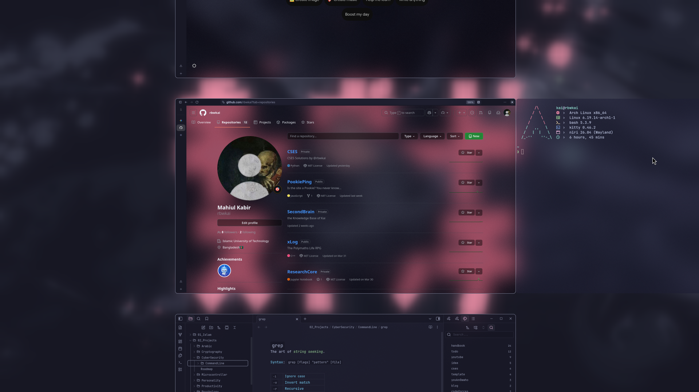

<div align="center">

# 🍚 Dotfiles

*saying **I use arch, btw** has never felt so awesome*

**Minimal, Aesthetic, Productive Arch Niri rice -by @rbwkai**

---


</div>

## 📸 Showcase

<div align="center">
  
  <br/><br/>
</div>

## 📦 Software & Dependencies

This setup relies on **Arch Linux** and the **Niri** window manager. 

Here is a quick command to grab the core packages and tools (assuming you have an AUR helper like `yay` set up for AUR-specific ones like `niri` or `zen-browser-bin`):

```bash
# Install core packages via pacman
sudo pacman -S kitty neovim obsidian yazi btop tree fastfetch nmap stow

# Install AUR packages (Zen Browser, etc.)
yay -S zen-browser-bin
```

## 🚀 Installation (stow)

This repository is designed to be managed with [GNU Stow](https://www.gnu.org/software/stow/).

```bash
# 1. Clone the repo to your home directory
git clone https://github.com/rbwkai/dots.git ~/dots
cd ~/dots

# 2. Use stow to create the symlinks
stow .
```

*Note: If you run into conflicts, make sure to back up or remove your existing configurations in `~/.config` before running `stow .`*

---